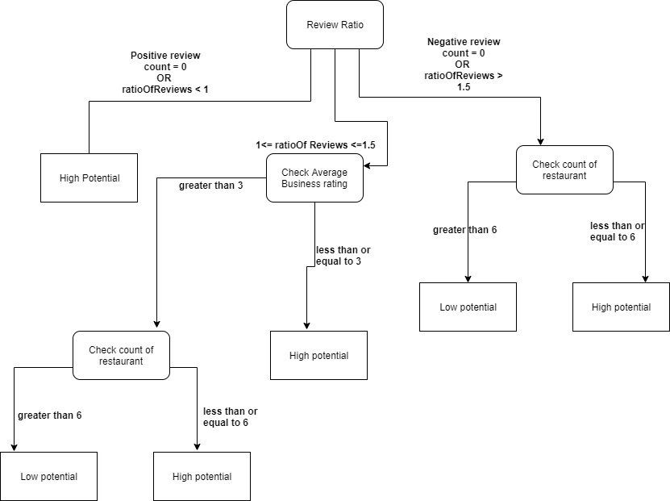

&nbsp;
&nbsp;
&nbsp;

 
<iframe width=1000 height=1000 src="https://snehavidekarovgu.shinyapps.io/DecisionSupportSystem/"
frameborder="0" allowfullscreen=true></iframe>

&nbsp;
&nbsp;
&nbsp;

# GUI Overview

We created an interactive GUI, where we used Leaflet library which uses Open Street maps. The idea is to answer our question of using HCI techniques for creating Decision support system.

#### Guide through interface

The center of our application is a scrollable user friendly map which consists of area with street names and landmark names. On the left hand side, there are four drop down menus which provide choices for selecting:
 
 - State
 - City
 - Restaurant type 
 - Decision model.
 
The cities get dynamically updated based on the selected state. The restaurant category and model selection remains fixed. As explained in the previous section, the lack of enough computing power has allowed selection for only two states. 

There are 26 categories of restaurants to choose from and either Naive Bayes or Random Forest can be selected for decision model. There are two buttons below drop down menus; Search and Reset. Additionally clicking the 'About' tab adjacent to 'Interactive Map' will forward to the screencast explaining about our project briefly.

#### Working

Clicking search after appropriate selections in drop-down menu will highlight the selected business type in that city of state. Based on the amount of data and selected machine learning model, User would have to wait for results which will be indicated by the loading bar at the bottom right corner of map. Once done, the markers will show the location of that business. Clicking individual marker will display following things:

- Name of the restaurant
- Address
- Business rating
- Three ternary categories indicating the facilities of that restaurant where outputs are 'Yes' or 'No' or 'Not available'

The color of the marker indicates approximate cost per person for that business. We have four different price points, which are also shown in map legend:

- NA - Information not available
- under 10$
- 11$ - 60$
- over 60$

Additionally, the reset button will reset the entire map and go back to preselected values. There will also be cases where there are no available restaurants in that city and state for selected category. In that case, the center screen will display an empty map.

#### Decision logic

Once a user searches for a particular restaurant, with location updates in map, there is a summary table generated which is as explained below:

- Count of total number of restaurants of the selected category

- Average restaurant rating: Take the mean value of ratings of all the restaurants in the selected category.

- Total number of reviews left by customers for all the selected category of restaurants. 

- Number of postive/ negative reviews: Based on the selected model by user from drop down menu, The reviews will be predicted by the trained model, as explained in detail in NLP section and a label will be assigned; positive/ negative based on the model prediction. 

Below that we find the final prediction indicating the potential of new business of the selected restaurant category in the selected city and state. The text below that gives an explaination behind that prediction. And Finally, The last text 'Recommended facilities' will give opinion to the potential investor or new business owner of what facilities would be beneficial if they decide to open the business. The explaination of 'Prediction' and 'Recommended facilities' is explained below.

Our prediction decision is based on a rule-based system which takes various predictors into account. It is summarized in the figure below.

&nbsp;
&nbsp;

1. First review ratio is calculated, where all the reviews from the selected restaurant type are classified into positive or negative based on the NLP model used. Then positve reviews are divided by negative to calculate the review ratio.

2. Based on the ratio value, it can reach three outcomes where if the value is less than 1, it is directly decided as High potential for opening selected type of business in this particular city. For other outcomes, it again goes through various decision nodes.

3. If ratio value is between 1 and 1.5, we check for average business ratings as well as count of this particular type of restaurants for giving the final decision.

4. Finally, for ratio  value of greater than 1.5, we only check for count of restaurants for giving the final decision.

5. There can be edge cases where the model doesn't classify even a single review as positive or vice-versa. In that case, the decision will be taken as shown in the figure.

Our decision tree logic is based on certain factors in the data like higher counts of positve reviews than negative in the dataset, making use of model predictions and a through analysis of dataset which were useful in establishing the current threshold of average business ratings and count of restaurants. For explainability, every decision is accompanied by an explaination behind the decision. 

#### Facilities logic

Below the explaination of decision, we included 'Recommended facilities'. It's outcome is based on the selected category of restaurant in the following way:

1. For selected category, if there are N number of restaurants where N > 0. And the rule-based system gives a certain decision.

2. If the decision is 'High Potential', we take individual statistical Mod of the three ternary categories indicating the facilities of that restaurant for the given N restaurants.

3. Based on the Mod value, we show the outcome. For e.g. If selected N restaurant is 7 where 4 of them answer Yes to 'Outdoor Seating' and 'Take out option' and only 3 answer Yes to to 'Restaurant delivery', We show 'Outdoor Seating' and 'Take out option' in the recommended facilities. 

4. The facilities doesn't show up in cases like:
  
    - Where the decision outcome is 'Low Potential'
    - When the Mod value for facilities is either 'No' or 'Not Available'

