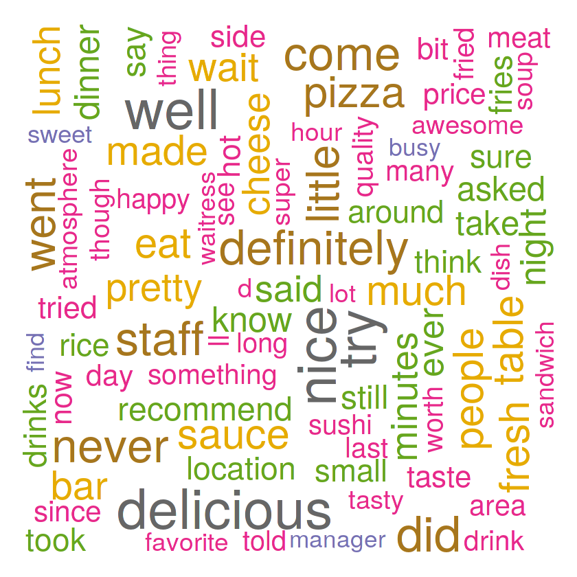
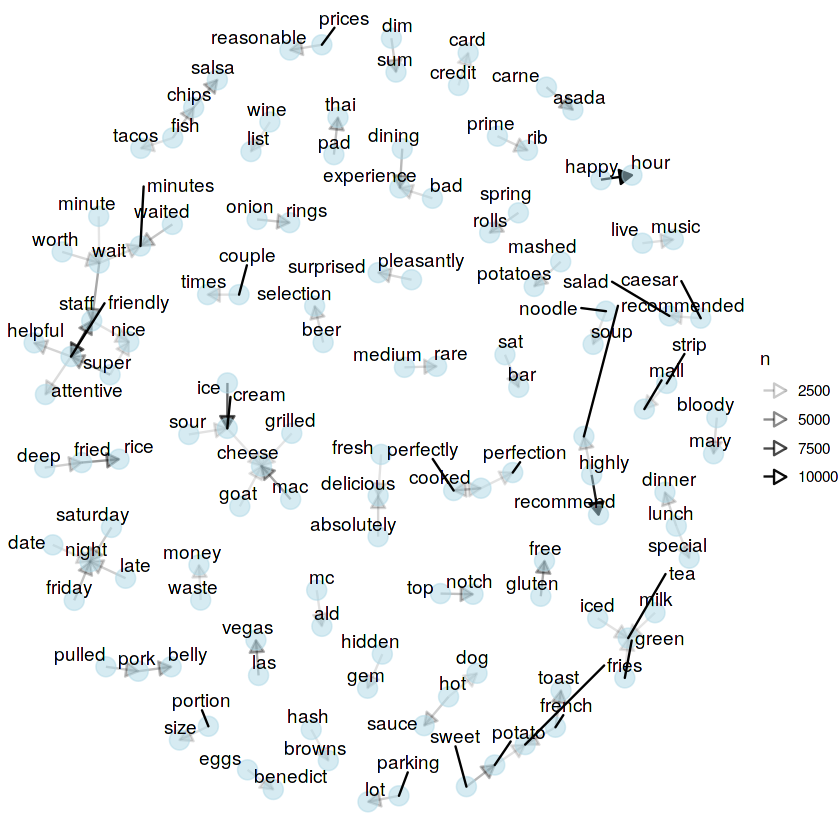
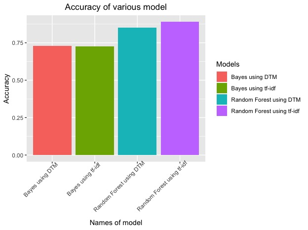
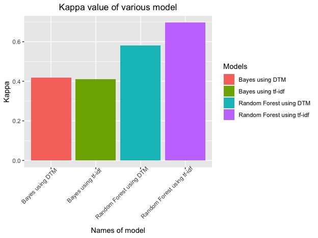

&nbsp;
&nbsp;
&nbsp;

We use Review.json dataset for performing Natural language processing, which extracts and summarizes information for textual corpus. Our idea is to build a model which analyzes tge sentiment of the user written reviews and classifies them into negative or positive review. The model will be used in our GUI, where a user selects a particular restaurant category for the given city and state. The restaurants of that paritcular type will have user reviews which we then feed into our model to get there classification into positive/ negative. We then use this information into building our rule-based decision system. It is descrbed in detail in GUI section. We use Topic Modelling, one of the tasks of NLP to build our classification model.

>> **Topic Modeling**: The NLP task of identifying automatically identifying major themes in a text, usually by identifying informative words.

The Review.json contains following attributes:

- Review Id
- User Id
- Business Id, which maps to businesses in business.json
- star rating
- Review in free form text
- votes on the reviews


#### <span class="header">Preprocessing</span>

We preprocess the text to remove many characters, punctuations and white spaces which doesn't convey much meaning, remove website links and non english language text. We also remove stop words, perform stemming and convert text into lower case. 

And at last we add a Y-label, a label attribute to dataset which labels each review (row of text) as positive or negative. This manual labeling was done heuristically based on human ability to recognize the sentiment. We analysed the review language and their respective star rating and it was deduced that reviews with less than or equal to 2 stars were negative in nature and reviews with more than 2 stars were positive. We tested our deduction on many different reviews belonging to different businesses spreaded across different states, cities and countries to check for its general performance, before including in our work.    

>>**Stop words**: The words and phrases which occur frequently in the language but doesn't acount to any information. Words such as 'is', 'the', 'of' ,'and' are some of the examples of stop words. \ \
**Stemming**: Removing all the inflection expression such as prefix and suffix from words. For instance, the root form of "horses", "horse", and "horsing [around]" is the same word: "horse". For some NLP tasks, we want to count all of these words as the same word.

&nbsp;

```{r,echo = TRUE,eval= FALSE}
df<-transform(df, text = as.character(text)) #reviews column is of character type
#Detect non english text
non_alpha <- (unlist(str_match_all(df$text, "[^A-Z-^a-z]")))
unique(non_alpha)


#######Cleaning the text########
df$text<-lapply(df$text, function(x) gsub("[^\u0001-\u007F]+","", x)) #remove text which is not english
df$text <-gsub('http[[:alnum:]]*',' ',df$text) #remove website links
df$text <- tolower(df$text) #make the whole text to lower
df$text <- removeNumbers(df$text) #remove numbers from review
df$text <-gsub('[[:punct:] ]+',' ',df$text) #remove punctuation
df$text <- stripWhitespace(df$text) #remove extra whitestrip
df$text <- removeWords(df$text, stopwords("english")) #stop word removal
df$text <-SnowballC::wordStem(df$text, language = 'en') #stemming

#Detect non english text
non_alpha <- (unlist(str_match_all(df$text, "[^A-Z-^a-z]")))
unique(non_alpha)

####renaming few words#####
df$text <- df$text %>%    #rename few words
  str_replace_all("don", " do not ")
df$text <- df$text %>%
  str_replace_all("didn", " did not ")
df$text <- df$text %>%
  str_replace_all("wasn", " was not ")


df$text <- stripWhitespace(df$text) #remove extra space

df$review_sentiment <- ifelse(df$stars>3, "positive", "negative") #label the dataset

#custom stop word elimination
stopwords_freq<-c("food", "t", "s", "good", "place" ,"great", "not", "service", "like", "just", "time" ,"one", "back" ,"get", "go", "can" ,"do" ,"really", "will" ,"ordered", "us" ,"order" ,"restaurant", "chicken" ,"also", "got" ,"ve", "came", "even", "menu" ,"re" ,"m")
df$text <- removeWords(df$text, stopwords_freq)
```

&nbsp;

#### <span class="header">Visualisation</span>

We use wordcloud and Bi-gram to visualise the most occuring words and their connections with other words in the text.


```{r,echo = TRUE,eval= FALSE}
df_cloud<-freq_terms(df$text, 155)
wordcloud(words = df_cloud$WORD, freq = df_cloud$FREQ,colors=brewer.pal(8, "Dark2"),rot.per=0.35,max.words=120)
```

<center>
</center>

&nbsp;

```{r,echo= TRUE, eval = FALSE}

df_bigram<-df%>% 
  unnest_tokens(word, text, token = "ngrams", n = 2) %>% 
  separate(word, c("word1", "word2"), sep = " ") %>% 
  filter(!word1 %in% stop_words$word) %>%
  filter(!word2 %in% stop_words$word) %>% 
  filter(word1 != word2) %>%
  unite(word,word1, word2, sep = " ") %>% 
  count(word, sort = TRUE) %>% 
  slice(1:80)

df_bigram$first_words <- str_extract(df_bigram$word,"(\\w+)")
df_bigram$second_words <- str_extract(df_bigram$word,"(\\w+$)")
df_bigram<-df_bigram %>% select(first_words, second_words, n)
graph <- graph_from_data_frame(df_bigram)
ggraph(graph, layout = "fr") +
 geom_edge_link(aes(edge_alpha=n),arrow = arrow(type = "closed", length = unit(3, 'mm'))) +
  geom_node_point(color = "lightblue",alpha=0.5,size=5) +
geom_node_text(aes(label = name), vjust = 1, hjust = 1,repel=TRUE)+
  theme_void()

```

<center>
</center>


&nbsp;

#### <span class="header">Feature generation</span>

After preprocessing we build a corpus of text and generate feture dataset out of it. We use Document-term matrix (DTM) methodology for getting most frequent terms. We removed the sparse occuring terms and also added two additional aatributes in with DTM  which showed number of words in reviews and it's length respectively. 

>>**Document-term matrix**: It is a mathematical matrix, describing the frequency of a particular term in the document, where row is documents in the collection and columns correspond to terms.

```{r,echo = TRUE,eval= FALSE}

review_corpus<-Corpus(VectorSource(df$text)) #corpus of reviews 
dtm_train <- DocumentTermMatrix(review_corpus) #document term matrix
dtm_corpus <- removeSparseTerms(dtm_train, 0.90)
dtm_train_matrix <- as.matrix(dtm_corpus)
dtm_train_matrix <- cbind(dtm_train_matrix,df$word_count,df$text_len)    #binding word_count and text_len
dtm_train_matrix <- cbind(dtm_train_matrix, df$review_sentiment) #bind the y label
colnames(dtm_train_matrix)[ncol(dtm_train_matrix)] <- "y" #rename the column

training_set <- as.data.frame(dtm_train_matrix) #convert to data frame
training_set$y <- as.factor(training_set$y)
training_set[,24] <- as.numeric(as.character(training_set[,24]))
training_set[,25] <- as.numeric(as.character(training_set[,25]))
training_set[sapply(training_set, is.factor)] <- lapply(training_set[sapply(training_set, is.factor)], as.integer)
#unique(training_set$y)
training_set<-transform(training_set, y = as.factor(y))

```

&nbsp;

Here is the sample of the how the feature set looks like

```{r, echo=FALSE}
library(rio)
sample <- import('Figs/sample.xlsx')
sample
```

&nbsp;

#### <span class="header">Splitting the dataset</span>

To ensure that there is no data-leak from the testset into our model. The training data of review text comes from different states than the states we use in our GUI. We split the dataset into two parts; train_model and train_app. train_model goes into our training. We check the performance of our model on train_app, which is also the dataset which we use in our GUI.

```{r,echo = TRUE,eval= FALSE}
#remove the training data and the remaining data is used in shiny application
train_model<-head(training_set,100000)
train_app <- tail(training_set, -100000)
test_set <- subset(train_app, select = -c(y) ) #remove the y label from the data to be used in shiny application

```

&nbsp;

#### <span class="header">Classificatio models</span>


We use two of the already available models from R packages; Naive bayes [(NB)](https://www.rdocumentation.org/packages/e1071/versions/1.7-3/topics/naiveBayes) & Random Forest [(RF)](https://www.rdocumentation.org/packages/randomForest/versions/4.6-14/topics/randomForest) trees. It was set to default parameters.

```{r,echo = TRUE,eval= FALSE}

########Naive Bayes model######
review_model_bayes<-naiveBayes(y~., data=train_model) #training on naive bayes model

####Testing the model#####
review_model_bayes_predict<-predict(review_model_bayes, newdata=test_set, type="class") #test on the data 
#actual and predict dataframe
review_model_bayes_predict_df<- cbind(review_model_bayes_predict, train_app$y) 
colnames(review_model_bayes_predict_df)[1] = "predicted"  #dataframe containg actual value and predicted value
colnames(review_model_bayes_predict_df)[2]='original'
head(review_model_bayes_predict_df,5)
review_model_bayes_predict_df<-as.data.frame(review_model_bayes_predict_df)
review_model_bayes_predict_df<-transform(review_model_bayes_predict_df, original = as.factor(original))
review_model_bayes_predict_df<-transform(review_model_bayes_predict_df, predicted = as.factor(predicted))


random forest model 
rf_dtm_100 <- randomForest(
  y ~ .,
  data=train_model,ntree=500   #randomforest model
)


#####Random Forest model#######
review_model_rf_predict<-predict(rf_dtm_100, newdata=test_set, type="class")
#actual and predict dataframe
review_model_rf_predict_df<- cbind(review_model_rf_predict, train_app$y)
colnames(review_model_rf_predict_df)[1] = "predicted"
colnames(review_model_rf_predict_df)[2]='original'
review_model_rf_predict_df<-as.data.frame(review_model_rf_predict_df)
review_model_rf_predict_df<-transform(review_model_rf_predict_df, original = as.factor(original))
review_model_rf_predict_df<-transform(review_model_rf_predict_df, predicted = as.factor(predicted))


```


&nbsp;

#### <span class="header">Model performance</span>

We use accuracy and [Cohen's Kappa](https://www.rdocumentation.org/packages/psych/versions/1.9.12.31/topics/cohen.kappa) measure to check for model performance. 

```{r,echo = TRUE,eval= FALSE}

# model data to plot
value_acc <- c(rf_acc*100,naive_acc*100)
value_kappa<- c(rf_kappa*100,naive_kappa*100)
names <- c("Random Forest","Naive Bayes")
df_res_kappa <- data.frame(names,value_kappa)
df_res_acc<- data.frame(names,value_acc)
```

```{r,echo=FALSE,results='hide',eval=TRUE}
library(rio)
library(ggplot2)
setwd("C:/Users/ysa pc/Desktop/projects/dsr/snehashiny3")
df_res_kappa <- import('kappa_chart.csv')
df_res_acc <- import('Accuracy_chart.csv')
```

```{r}
#ploting kappa values for both the model
p<-ggplot(data=df_res_kappa, aes(x=names, y=value_kappa,fill=names)) +
  geom_bar(stat="identity")+
  scale_fill_discrete(name= "Models") +
  labs(x ="Names of model", y= "Kappa", title = "Kappa value of models")+
  theme(plot.title = element_text(hjust = 0.5), plot.subtitle = element_text(hjust = 0.5),axis.text.x = element_text())
p
#ploting the accuracy of both the models
p1 <-ggplot(data=df_res_acc, aes(x=names, y=value_acc,fill=names)) +
  geom_bar(stat="identity")+
  scale_fill_discrete(name= "Models") +
  labs(x ="Names of model", y= "Accuracy", title = "Accuracy value of models")+
  theme(plot.title = element_text(hjust = 0.5), plot.subtitle = element_text(hjust = 0.5),axis.text.x = element_text())
p1

```

&nbsp;

#### <span class="header">TF-IDF</span>

We also tried supervised modeling, using the same generated Y-label with TF-IDF, which stands for "term frequency-inverse document frequency".

Here is a brief description how TF-IDF works:

1. Frequent words in a specific document are most likely to be important to the topic of that document.

2. Common words across all documents are most unlikely to be important to any topics.

A higher weight is assigned to that word i.e., if it's common in a specific document and also uncommon across all documents. 


We selected **Mesa** city of Arizona to perform TF-IDF to generate feature dataset and then apply the same classification models (Naive Bayes & RF trees) as we did to the DTM processed dataset. We show the comparative results below where we found RF trees performing slightly better than Naive bayes when TF-IDF technique is used.

&nbsp;

<center>
</center>

&nbsp;

<center>
</center>

&nbsp;

Due to high computational time complexity, we were not able to apply this to whole dataset and thus don't use in our final application. But it can be used in future where we can reduce time complexity with adequet hardware resources. 


